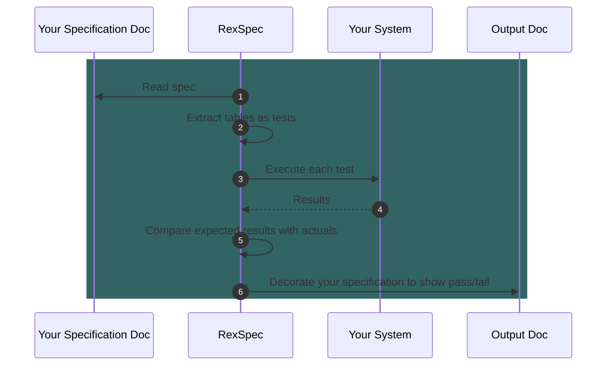
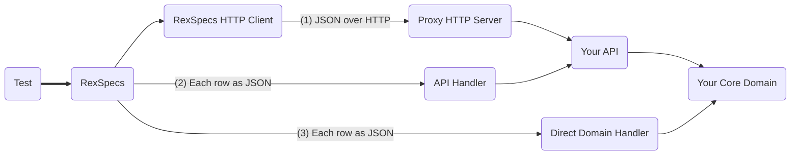

# RexSpecs

RexSpecs is a library for running executable specifications against the API surface of your applications or services. 
Executable specifications look like clear, well-formatted documents, yet they can also be executed as tests. This allows 
them to be used to specify, build and regression-test software, while acting as a repository for institutional product 
knowledge. They can even become a help or HowTo guide for the system, and are the perfect inputs for prompt-engineering 
to support a chat bot or SaaS help tool.

RexSpecs aims to support HTTP, GraphQL and queue-based events APIs. You can see progress below.

### What Is An Executable Specification?

We'll call them `RexSpecs`, because it's easier to type. RexSpecs are easy-to-read
documents that can also be understood by a computer and executed as tests against your codebase.
This keeps your documents constantly up-to-date, because otherwise the tests fail. This is an 
example of a Living Document - unlike a Word doc or a wiki page, you be sure that it tracks the
current behaviour of the system.

RexSpecs is modelled on Fit - the Framework for Integrated Test. The primary difference is that 
we focus entirely on te external APIs of your system. I hope this makes it extremely easy to 
know whether or not your code is delivering on your business rules.

Another difference is interoperability: RexSpecs is designed to allow different input sources, 
communication protocols, and data formats. Over time, I hope the number of supported variants
increases to cover everything in the next section.

### Overall Planned Scope

| Input Format | Input Source | Protocol    | Output Target | Supported |
|--------------|--------------|-------------|---------------|-----------|
| HTML         | File         | HTTP        | File          | Yes       |
| JSON         |              |             |               | No        |
|              | DB           |             |               | No        |
|              |              | GraphQL     |               | No        |
|              |              |             | DB            | No        |
|              |              | Event Queue |               | No        |
| DB Tables    |              |             |               | No        |
|              |              |             |               |           |

### Work in Progress

* Write a simple HTTP/Restful app to test the walking skeleton
* Fix all the annoyances
* Tidy up and refactor all the dependencies
* Add GraphQL support
* Make it run as part of a Gradle build
* Make it run with CTRL-SHIFT-F10 in IntelliJ

### Backlog

* All the choices in the table above (!)

### How It Works

### Three Ways To Connect To Your Target System

#### (1) RexSpecs sends you JSON via HTTP
You extend your HTTP API, or create a new one, to accept JSON from RexSpecs. You can then call your own APIs (GraphQL, queues, HTTP, etc) . This approach requires no Kotlin test fixtures but will require you to write some code to translate the JSON into your own API calls.

#### (2) RexSpecs sends your handler JSON, and your handler converts it to an API call
In Kotlin, you write a handler that accepts JSON from RexSpecs, and then calls your own APIs (GraphQL, queues, HTTP, etc)

#### (3) RexSpecs sends your handler JSON, and your handler calls your domain directly

In a Kotlin codebase, there is no need for an API call. You can call your domain directly, without calling your API layer.

