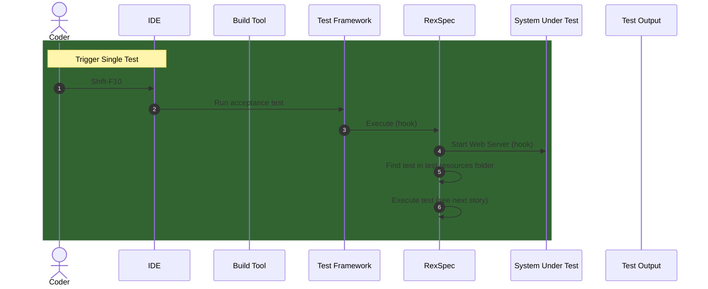
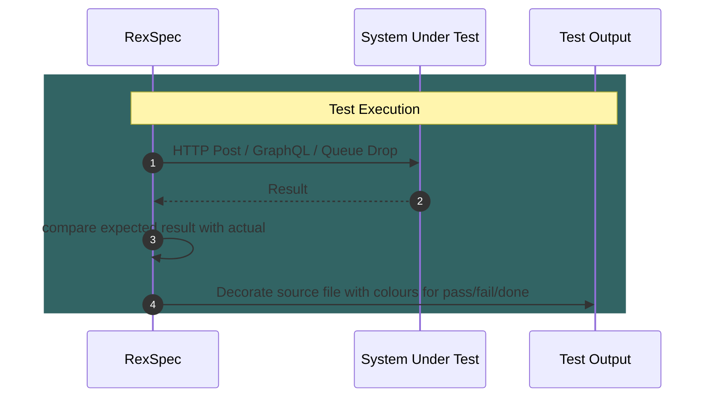
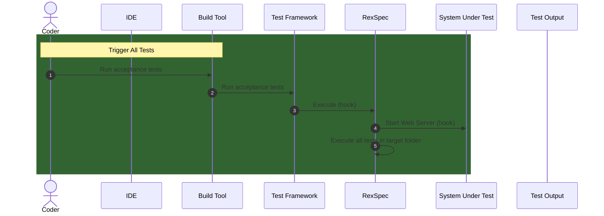

# RexSpec

Executable specifications for any system with an API (HTTP/GraphQL/Events/Whatever)

### Stories

#### Run a Single Test

```
As a Developer,

I want to be able to run a single test from my IDE,

So that I can iterate towards completing my current task without having to run the whole damn test suite

Acceptance Criteria:
* Shift-F10 in IntelliJ runs the file against the app

```




#### Execute Test

```
As RexSpec,

I want to be able to call API methods of the System Under Test,

So that I can compare the results with the expectations, and generate an output record

Acceptance Criteria:
* The Output Record is the same as the source file, but table cells are coloured, to
represent passing or failing tests 

```



#### Run All Tests

```
As a Developer,

I want to be able to run all my acceptance tests as part of the build,

So that I can commit knowing that the whole application works

Acceptance Criteria:
* The test task in the build fails if any acceptance test fails

```




