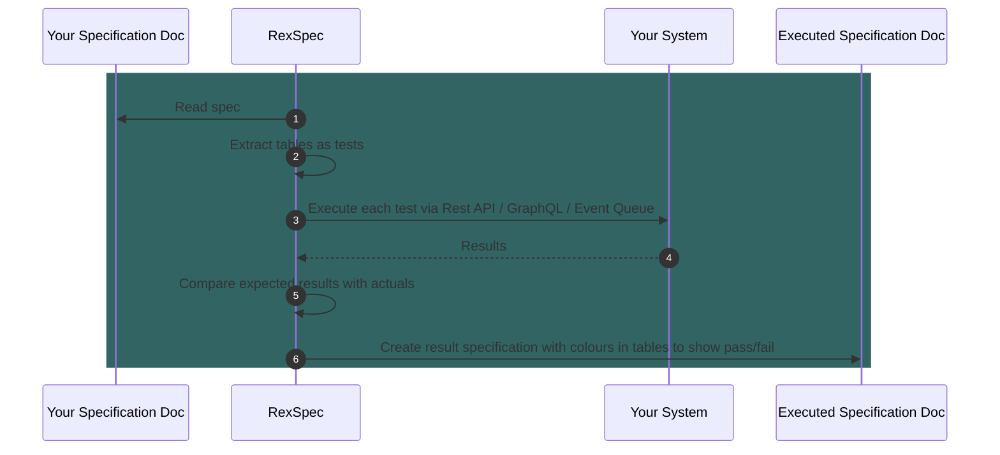

# RexSpecs

Executable specifications for any system with an API (HTTP/GraphQL/Events/Whatever).

### What Is An Executable Specification?

Firstly, let's call them RexSpecs, it's easier to type (and say). RexSpecs are easiy-to-read
documents that can also be understood by a computer and executed as tests against your codebase.
This keeps your documents constantly up-to-date, because otherwise the tests fail. This is an 
example of a Living Document - unlike a Word doc or a wiki page, you be sure that it tracks the
current behaviour of the system.

RexSpecs is modelled on Fit - the Framework for Integrated Test. The primary difference is that 
we focus entirely on te external APIs of your system. I hope this makes it extremely easy to 
know whether or not your code is delivering on your business rules.

Another difference is interoperability: RexSpecs is designed to allow different input sources, 
communication protocols, and data formats. Over time, I hope the number of supported variants
increases to cover everything in the next section.

### Overall Planned Scope

| Input Format | Input Source | Protocol    | Output Target | Supported |
|--------------|--------------|-------------|---------------|-----------|
| HTML         | File         | HTTP        | File          | Yes       |
| JSON         |              |             |               | No        |
|              | DB           |             |               | No        |
|              |              | GraphQL     |               | No        |
|              |              |             | DB            | No        |
|              |              | Event Queue |               | No        |
| DB Tables    |              |             |               | No        |
|              |              |             |               |           |

### Work in Progress

* Write a simple HTTP/Restful app to test the walking skeleton
* Fix all the annoyances
* Tidy up and refactor all the dependencies
* Add GraphQL support
* Make it run as part of a Gradle build
* Make it run with CTRL-SHIFT-F10 in IntelliJ

### Backlog

* All the choices in the table above (!)

### How It Works

